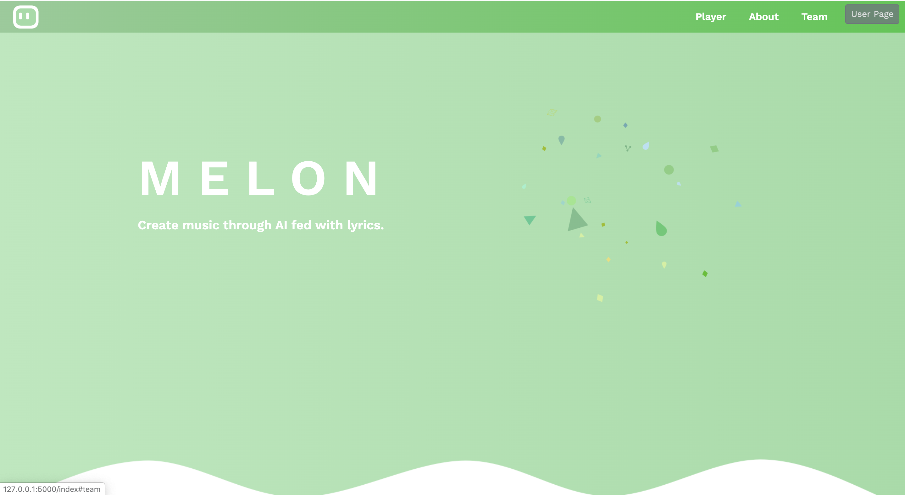
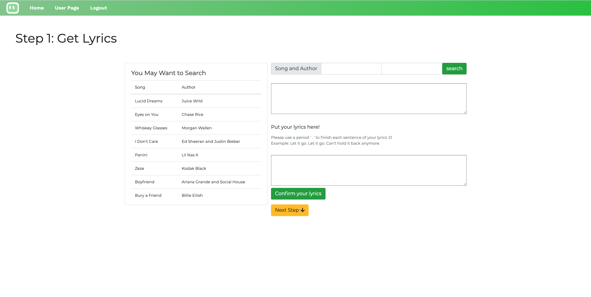
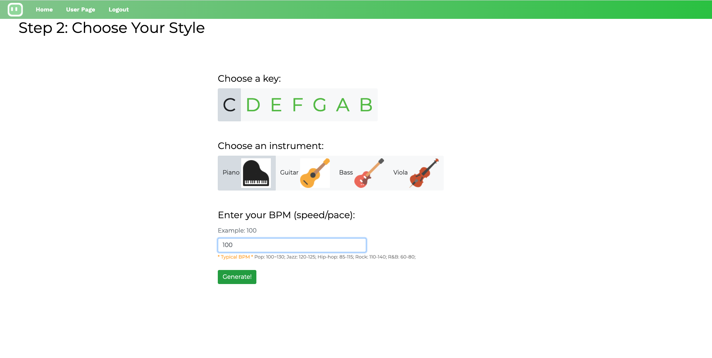
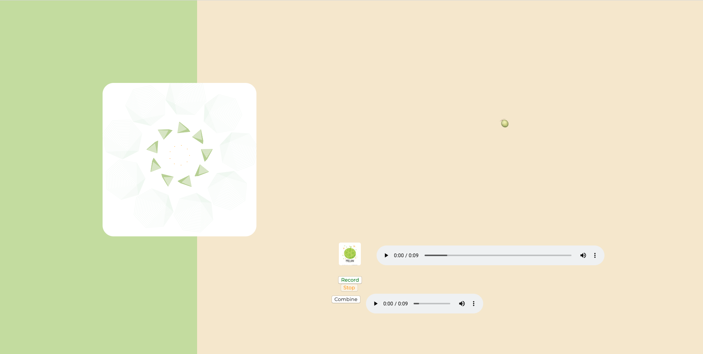

# Melon - Create music through AI fed with lyrics.

Melon is an AI melody generator platform. By feeding  original text into the lyrics-to-melody generative model reinforced by neural networks and create music.

## Introduction

We train a conditional-GAN model based on LSTM with 10000+ paired midi files and lyrics to learn the correlations between lyrics and the rhythm, punctuation and emotions of the music. We also add multiple keys and instruments options to customize melody according to users' needs.

We want to build a easy-to-use melody generation platform to help those intimidated by the difficulty of music-making to have fun in generating original melodies, and inspire those who are interested in writing songs to further explore their potential in producing quality music.

There are some basic tools in our website:

### 1.  __Lyrics searching__

### 2.  __Melody generation with lyrics__

Conditional GAN with LSTM

### 3.  __Recording tools__

For the new users, please the instruction on https://feitianxiaozhucjq.wixsite.com/melon to get started!

Currently our model is running on http://melonclient-env.eba-girgxpmz.us-west-2.elasticbeanstalk.com/. You can try to generate your own piece of lyrics with your favorite lyrics!

## Tutorial

If you want to run the whole pipeline on your own computer, plase follow the steps:

1. Create a environment of Python 3.6, and install the requirements.txt using pip install -r requirements.txt.

2. Download required sources from: https://drive.google.com/file/d/1y4xlxM0drLdbFbOIsw6Fbh0XfRAPVqkX/view?usp=sharing

3. Place the entire data folder under app/Melon_Model.

4. brew install fluidsynth (if haven't)

5. Run the web server!

After cloning the github, you can refer to the document (displayed in webpage) in docs/build/html/index.html.
